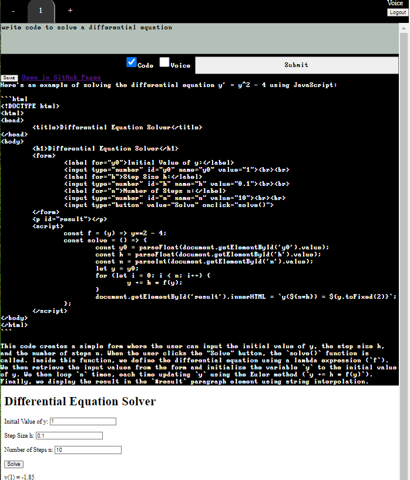

# chat-gpt-voice

Under 100 lines of plain JS code creates a voice bot using [ChatGPT](https://chat.openai.com "ChatGPT is an artificial-intelligence (AI) chatbot developed by OpenAI and launched in November 2022. It is built on top of OpenAI's GPT-3.5 and GPT-4 families of large language models (LLMs) and has been fine-tuned (an approach to transfer learning) using both supervised and reinforcement learning techniques.") [API](https://platform.openai.com/docs/api-reference/chat "gpt-3.5-turbo, is the same model used in the ChatGPT product. It is priced at $0.002 per 1k tokens, which is 10x cheaper than our existing GPT-3.5 models. It’s also our best model for many non-chat use cases—we’ve seen early testers migrate from text-davinci-003 to gpt-3.5-turbo with only a small amount of adjustment needed to their prompts.")

I wrote it primarily so I could easily ping ChatGPT on my mobile device (Added [PWA](https://en.wikipedia.org/wiki/Progressive_web_app "A progressive web application (PWA), or progressive web app, is a type of application software delivered through the web, built using common web technologies including HTML, CSS, JavaScript, and WebAssembly. It is intended to work on any platform with a standards-compliant browser, including desktop and mobile devices.") support using manifest.json)

Employs [Web Speech API](https://developer.mozilla.org/en-US/docs/Web/API/Web_Speech_API "The Web Speech API enables you to incorporate voice data into web apps. The Web Speech API has two parts: SpeechSynthesis (Text-to-Speech), and SpeechRecognition (Asynchronous Speech Recognition.)")'s interfaces for speech recognition and text synthesis, enabling speech-to-text and text-to-speech capabilities.

Simply tap/click on the body of the page to activate speech recognition

<strong>Live demo:</strong>

https://raw.githack.com/jay23606/chat-gpt-voice/main/chat.html (or tinyurl.com/gpt-voice)

I've also added a form of "tabs" using iframes and a way to toggle to vanilla-chatgpt

https://raw.githack.com/jay23606/chat-gpt-voice/main/tabs.html (or tinyurl.com/gpt-voice-tabs)

Requires entering in an [API key](https://platform.openai.com/account/api-keys "An API key is a unique code generated by a service provider that allows access to their application programming interface (API). It is essentially a secret access code that helps the API provider identify and authenticate the user or application making the API request. It is commonly used by developers to access and use services and data provided by web-based applications and services. The API key is usually required to be included in the header or query string of the API request to allow access to the requested API resources.") from [openai.com](https://chat.openai.com "Navigate to ChatGPT") which is stored in localStorage 

<strong>To get api key:</strong>

https://platform.openai.com/account/api-keys

A checkbox is included to enable or disable STT and TTS whose state is also stored in localStorage

<strong>Screenshots</strong>:

It can now write it's own javascript apps:

<strong>Inspiration:</strong>

https://github.com/casualwriter/vanilla-chatgpt

https://mdn.github.io/dom-examples/web-speech-api/speech-color-changer/

